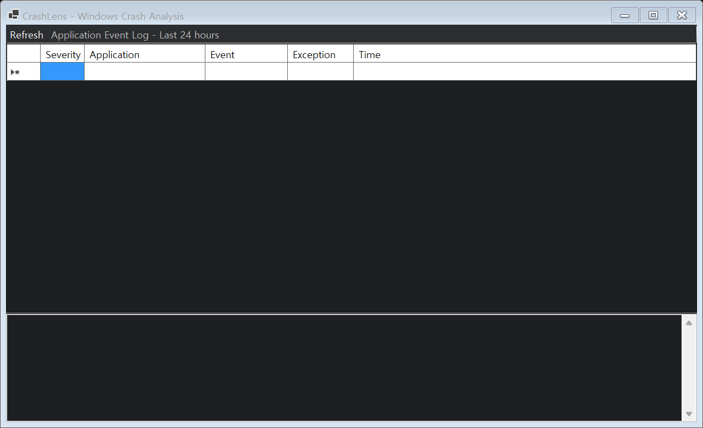

# CrashLens

Windows에서 발생한 프로그램 충돌과 멈춤 현상을 빠르게 확인하는 데스크톱 분석 도구입니다.

CrashLens는 복잡한 이벤트 뷰어 대신 최근 오류를 한 화면에 정리해 보여 줍니다. 어떤 프로그램이 언제 중단됐는지, 오류 모듈과 예외 코드는 무엇인지, 원본 이벤트에는 무엇이 기록됐는지 확인할 수 있습니다.

## 다운로드

**[Windows 설치 파일 다운로드](https://github.com/jeonghayoon11/CrashLens/releases/download/v0.1.0/CrashLens-Setup-0.1.0.exe)**

다운로드한 `CrashLens-Setup-0.1.0.exe`를 실행한 뒤 이용약관에 동의하고 설치 경로를 선택하세요. 설치 과정에서 바탕화면 바로가기를 만들 수 있으며, 설치 후 시작 메뉴에서 CrashLens를 실행할 수 있습니다.

## 실제 프로그램 화면

## 사용 방법

1. [Releases](https://github.com/jeonghayoon11/CrashLens/releases)에서 `CrashLens.Desktop.exe`를 다운로드해 실행합니다.
2. 프로그램을 열면 최근 24시간의 Application 로그가 목록에 표시됩니다. 상단의 **Refresh**를 누르면 최신 기록을 다시 읽습니다.
3. 목록에서 오류 항목을 클릭하면 아래에서 오류 코드, 관련 모듈, 원본 이벤트, XML을 확인할 수 있습니다.
4. 창을 닫아도 CrashLens는 작업 표시줄 알림 영역에서 계속 실행됩니다. 새 프로그램 충돌이 기록되면 빨간 오류 알림이 나타납니다.
5. 알림을 클릭하면 CrashLens가 열리고 최근 충돌 목록이 갱신됩니다. 완전히 종료하려면 트레이 아이콘을 오른쪽 클릭한 뒤 **Exit**를 선택합니다.

> 알림은 CrashLens가 실행 중일 때만 표시됩니다. 충돌의 원인을 확정하는 것이 아니라 Windows가 남긴 오류 기록을 정리해 보여 줍니다.

## 이런 경우에 사용하세요

- 프로그램이 갑자기 종료됐는데 원인을 확인하고 싶을 때
- 게임, 업무 프로그램, 개발 도구의 충돌 정보를 빠르게 모아보고 싶을 때
- Windows 이벤트 뷰어의 긴 로그 대신 핵심 항목부터 확인하고 싶을 때
- 기술 지원이나 버그 제보를 위해 오류 정보를 복사하고 싶을 때

## 주요 기능

- 최근 애플리케이션 충돌, 멈춤, Windows 오류 보고 검색
- 프로그램별 충돌 목록과 발생 시간 표시
- 실행 파일 경로, 오류 모듈, 예외 코드, 프로세스 ID 확인
- 대표 오류 코드의 쉬운 설명 제공
- 원본 이벤트 메시지와 XML 로그 확인
- Markdown, JSON, 텍스트 형식의 오류 보고서 내보내기
- 로컬 사용자 이름과 경로를 가릴 수 있는 개인정보 보호 기능

## 확인하는 이벤트

| 이벤트 ID | 종류 |
|---|---|
| 1000 | Application Error (프로그램 충돌) |
| 1001 | Windows Error Reporting (오류 보고) |
| 1002 | Application Hang (프로그램 멈춤) |

## 현재 상태

CrashLens는 초기 개발 단계입니다. 공개 테스트용 실행 파일을 준비 중이며, 첫 릴리스 전까지는 화면 구성과 이벤트 분석 기능을 다듬고 있습니다.

## 오픈소스

문제 제보나 기능 제안은 [Issues](https://github.com/jeonghayoon11/CrashLens/issues)에서 남겨주세요. 기여 방법은 정리 후 안내하겠습니다.

## 라이선스

[MIT License](LICENSE)
